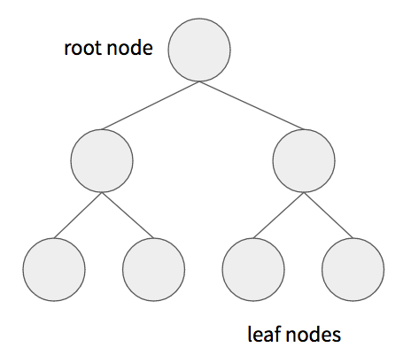
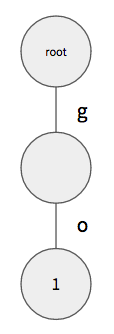
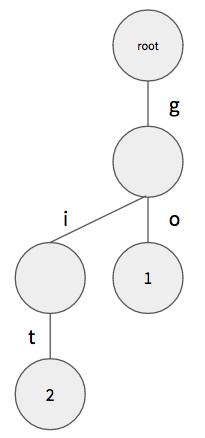
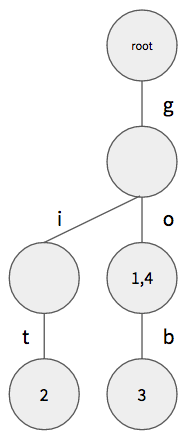
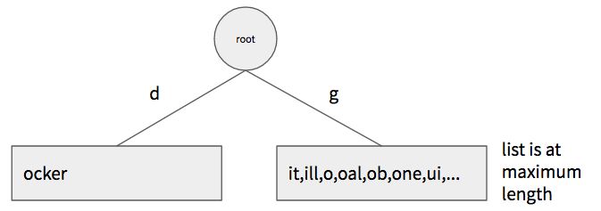
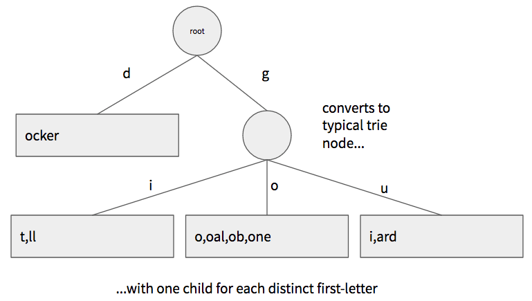

On many social media systems, you can refer to other users in your posts. As soon as you start typing a name, you often get a list of possible matches. The system might have millions of users, but it's able to show you suggestions as quickly as you can type.

Enabling this sort of suggest-as-you-type feature requires a fast, in-memory index. These indexes can use several different kinds of data structures depending on what kind of queries they need to answer. The data structure we commonly use when we need to find entries that match a prefix string is known as a **trie** (pronounced "tree" or "try"). The name comes from the word re**trie**val, which indicates that this structure is designed for search and retrieval operations, specifically searching for things that match a prefix string.

## What is a Trie?

A trie is a type of tree structure. You might remember tree structures from your computer science courses, but in case you don't, a tree is a hierarchical structure that is comprised of **nodes**. Each node is implemented as an object or struct, depending on your programming language. Each node may point to multiple child nodes, and conversely most nodes have a single parent node. The node at the start of the tree is known as the **root node** and it is the only node with no parent. If a node has no child nodes, it's known as a **leaf node**. A typical binary tree would look like this:

As the name implies, a _binary_ tree has at most two children per-node, but tree structures that have many children per-node are known as _n-ary_ trees. Tries are _n-ary_ trees.

## What do Tries Store?

Like other search-oriented data structures, a trie stores **keys** and associated **values**. Together, the key and value are called an **entry**. The key is always a string, but the value could be of any type, as the trie just stores and retrieves it as an opaque value. Often this value is a unique identifier or pointer that gets you to some data related to the key (e.g., primary key of a record in a DBMS).

Like a map, a trie can also be used to store only keys with no associated values. For example, a simple list of dictionary words might not need associated values, but you might want to find all words that start with a given prefix. In these cases we use a variant of a trie that only stores keys with no associated values. The structure is similar, but we can save a little memory in each node.

## Adding Keys and Values

A trie constructs a tree of nodes based on the letters in the keys added to it. The tree starts with a single root node that holds no values. When a new key/value pair is added, the trie follows this algorithm:

- let current node = root node
- for each letter in the key
	- find the child node of current node associated with that letter
	- if there is no child node associated with that letter, create a new node and add it to current node as a child associated with the letter
	- set current node = child node
- add value to current node

> **Note:** if you want to support multiple languages, the "letters" here refer to complete Unicode characters. In Go, full Unicode characters are represented by the `rune` type, and you must use particular constructs to iterate the runes in a string, as they may be different byte lengths. See the discussion in the [Simple Types](../golang#secsimpletypes) section of The Go Language tutorial.

For example, say we add the key `"go"` with the value `1` to the trie. The resulting structure would look like this:

Since our tree was empty to begin with, we add a new node and level for each letter in the key. The final leaf node then holds the associated value.

If we next add the key `"git"` with the value `2`, the structure would grow to look like this:

Note how we re-used the existing node for `"g"` but we added new nodes for `"i"` and `"t"`.

If we next add the key `"gob"` with the value `3`, the structure would grow to look like this:

Notice how we re-used the existing nodes for `"g"` and `"o"` and only had to add one new node for `"b"`. Although we reused those first two nodes, we can still tell that both the keys `"go"` and `"gob"` were added to the trie because there's a value stored in the node pointed to by `"o"` and the node pointed to by `"b"`. As you traverse down the tree, every time you see a value, you know that you've read a complete key.

When indexing keys that are not unique (e.g., last names), we will often need to add the same key to the trie multiple times but with different values. For example, say we added the key `"go"` again, but this time with the value `4`. Since we already added that key, we won't need to create any new nodes, but we will need to add the value `4` to the node we arrive at when following the algorithm above.

As you might expect, the height of a trie is always equal to the length of the longest key added to it. This means that tries tend to be very wide and not terribly deep, which makes retrieval speed much quicker. Adding a new key requires creating at most _len(key)_ nodes, but if your keys share common prefixes (which is typical), you will re-use nodes from previously-added keys.

## Retrieving Keys and Values

At this point you can see how this structure sets us up for very fast retrieval of keys that start with a prefix. To do so, we follow this algorithm:

- let current node = root node
- for each letter in the prefix
	- find the child node of current node associated with that letter
	- if there is no child associated with that letter, no keys start with the prefix, so return an empty/nil list
	- set current node = child node
- current node now points to the branch containing all keys that start with the prefix; recurse down the branch, gathering the keys and values, and return them

The important thing to note here is that finding the start of the branch containing all keys and values takes at most _len(prefix)_ lookups, _regardless of how many entries there are in the trie_. The retrieval complexity depends on the length of the key prefix, not the number of entries in the trie, so the retrieval performance remains about the same as we add more entries. Compare that with a binary search tree, which requires at most _log(n)_ comparisons to find the first matching key, where _n_ is the number of _entries_ in the tree.

Since the branch we find for a short prefix might contain a lot of keys and values, we typically return only the first _m_ entries from the branch, where _m_ is a parameter passed by the caller (usually a relatively small value since we're often showing these as a list of suggestions). To get this subset, you do a depth-first recursion down the branch, following the letters in each node according to their alphabetical order. As soon as you gather _m_ keys and values, you return to stop the recursion.

## Hybrid Tries

Although tries offer very fast retrieval, they aren't terribly space-efficient unless most of your keys are short and share common prefixes (i.e., dictionary words). Longer keys that don't share prefixes create a "leggy" tree structure, resembling a many-tentacled octopus!

In these situations, it's common to use a variant known as a **hybrid trie**. Instead of always creating a new node for each letter in the key, the leaf nodes in a hybrid trie store a list of key suffixes until those reach some maximum number, for example, 50. When the 51st key is added, the leaf node the transforms itself into a typical trie node, and creates a new leaf node for each distinct first-letter in the key suffixes it holds. Each of the new child leaf nodes then stores what remains of the key suffixes for their respective letter.

It's easier to show this visually than to describe it. Assume that we a hybrid trie where one of the leaf nodes has the maximum number of key suffixes allowed:

If we try to add the key `"guard"` to this, we can't simply add the suffix `"uard"` to the right leaf node, as it has reached the maximum number of suffixes. So the node transforms itself into a regular trie node, adding new leaf nodes for each distinct first letter in its existing key suffixes. Those new leaf nodes then store what remains of the key suffix. Finally, the node adds the remaining suffix for the new key to the new leaf node associated with `"u"`.

These diagrams depict only the keys, but you can create a hybrid trie that also stores associated values. The leaf nodes would store key-suffix and value pairs instead of just the key suffixes.

